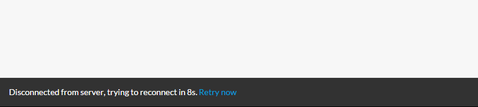

# Meteor Status

## What is it?
Meteor Status is a package which automatically alerts users when the connection to the server has been lost.
It also shows a countdown (in seconds) until the next retry and allows users to manually retry in the meantime.

The alert is fixed at the bottom of the screen and the design is based on Google's [Material Design snackbars](http://www.google.com/design/spec/components/snackbars-toasts.html).

Here is how it looks like:



This package should be compatible with packages like [Smart Disconnect](https://github.com/mixmaxhq/meteor-smart-disconnect) as the alert does not show up in case of a manual disconnect (triggered with `Meteor.disconnect()`).
Also, the first connection attempt (when the application is loaded for the first time) only shows the alert message on mobile (Cordova).

## Installation

Add the package in your Meteor application with this command:

```
meteor add 255kb:meteor-status
```

## Usage

Add the template before the `body` closing tag or anywhere else if you use the option `style=false` (see below):

    <body>
        ...
        {{> meteorStatus}}
    </body>


## Options

You can add the following options to the template: 

- `style=false`: remove style/UI/positioning (only displays the text and the link)
- `lang='en'`: change language (currently 'fr', 'en' and 'zh' supported, default to 'en')
- `position='top'`: change positioning for styled version ('top' or 'bottom', default to bottom)


    <body>
        ...
        {{> meteorStatus style=false lang='fr' position='top'}}
    </body>


## Changelog

### v1.3.2:
- alert does not show on first connection on cordova anymore (avoid having the alert showed at every startup)
- alert does not show on first retry when disconnected (avoid alert appearing too frequently when having a laggy mobile connection)

### v1.3.1:
- removed uneeded dependency (session)
- new language (chinese)

### v1.3.0:
- package rewritten to allow multiple instances, also lighter
- no more jquery dependency
- higher z-index for styled version
- ability to position to top
- lighter unstyled version (text only, no wrapping div)

### v1.2.0:
- Improved default design (font and link style)
- Option to disable UI/design (text only) 
- switch to local reactive vars instead of session vars
- added i18n support and French language
